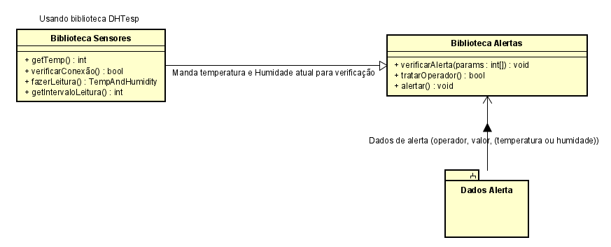

# DESAFIO ESTÁGIO FIRMWARE BZU TECH

### Seu objetivo será criar duas bibliotecas que funcionem em conjunto para monitorar e validar os dados provenientes de sensores conectados á ESP32. Além disso, você deverá criar uma função principal(main) que chame e execute essas duas bibliotecas em duas tasks diferentes. Não é necessário simular fisicamente os dados do sensor. Em vez disso, escolha um sensor compatível a ESP32 e utilize bibliotecas de terceiros para obter os valores dos sensores. A biblioteca de sensores será responsável pelo gerenciamento dos sensores, armazenamento dos dados e verificação de conexão dos mesmos. Já a biblioteca de alerta, será responsável por gerenciar os alertas que serão ativados de acordo com o operador escolhido e também o valor de referência para ativação da notificação. Exemplo:

1. Sensor 1 > 10
2. Sensor 2 < 25
3. Sensor 3 = 20

# RESOLUÇÃO

### Iniciei com um estudo dos requisitos, em seguida busquei a biblioteca (DHTesp) necessária para leitura dos dados do sensor escolhido (DHT22) em dispositivos ESP32 e parti para análise da estrutura do projeto usando UML, com isso cheguei ao seguinte modelo:

### Após isso comecei a implementação.
# Bibliotecas
## Sensores
### Uma classe, inicializa objetos DHTesp configurando pinagem de entrada de dados do sensor, com métodos:
1. getTemp(): Utilizada para verificar se o sensor está recebendo dados.
2. verificarConexao(): Verifica se o sensor está conectado ao pin certo.
3. fazerLeitura(): Retorna um objeto com dados de temperatura e humidade.
4. getIntervaloLeitura(): Retorna o tempo minimo entre leituras do sensor.

### Implementei usando paradigma orientado a objetos para facilitar a utilização de mais de um sensor.

## Alertas
### Funções que tratam os dados da biblioteca Sensores e verificam se os parâmetros informados pelo usuário implicam em um alerta.
1. verificarAlerta(): compara o valor de leitura vindo da placa/sensor com o valor estipulado pelo usuário.
2. tratarOperacao(): trata o operador fornecido pelo usuário e retorna um booleano com o resultado da operação.
3. alertar(): abstração de um sistema de alertas não implementado.

